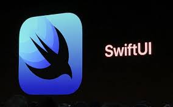
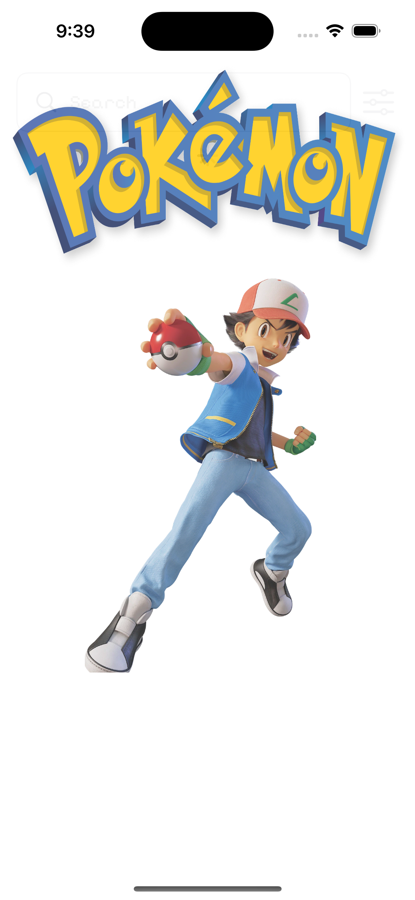
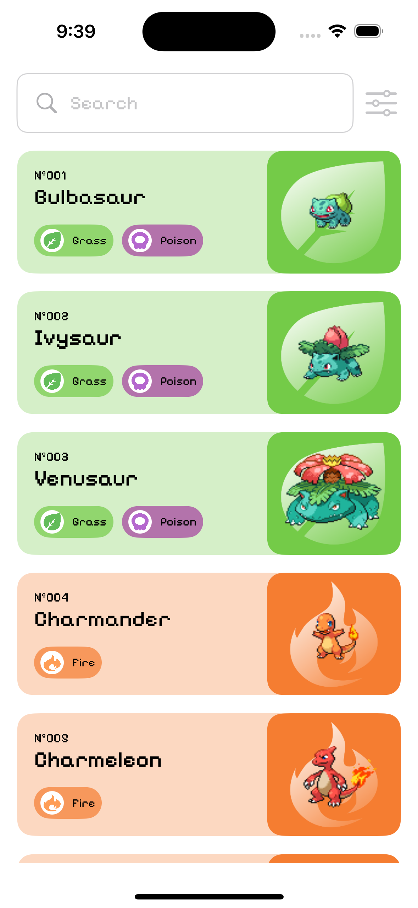
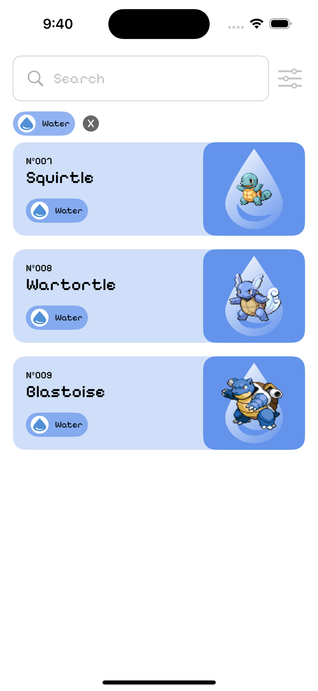
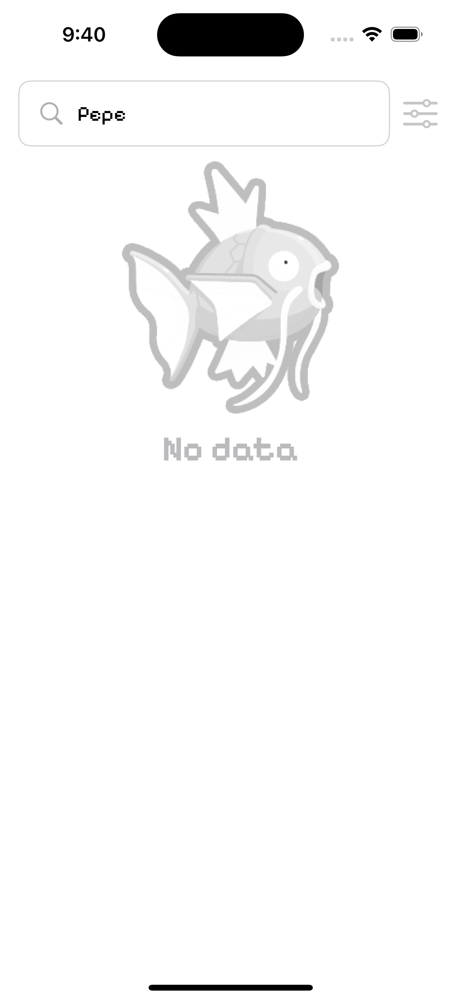

<!--
*** Thanks for checking out the Best-README-Template. If you have a suggestion
*** that would make this better, please fork the repo and create a pull request
*** or simply open an issue with the tag "enhancement".
*** Thanks again! Now go create something AMAZING! :D
-->


<!-- PROJECT LOGO -->
<br />
<p align="center">
  <a href="https://github.com/othneildrew/Best-README-Template">
    
  </a>

  <h3 align="center">Pokedex App</h3>
</p>


<!-- TABLE OF CONTENTS -->
<details open="open">
  <summary>Table of Contents</summary>
  <ol>
    <li>
      <a href="#about-the-project">Dependencies</a>
      <ul>
        <li><a href="#swiftgen">SwiftGen</a></li>
        <li><a href="#resolver">Resolver</a></li>
      </ul>
    </li>
    <li>
      <a href="#getting-started">Getting Started</a>
      <ul>
        <li><a href="#prerequisites">Prerequisites</a></li>
        <li><a href="#installation">Installation</a></li>
      </ul>
    </li>
    <li><a href="#redux">Architectural pattern Redux</a></li>
  </ol>
</details>


<!-- ABOUT THE PROJECT -->
## About The Project

  <a href="https://github.com/othneildrew/Best-README-Template">
    
  </a>
  <a href="https://github.com/othneildrew/Best-README-Template">
    
  </a>
  <a href="https://github.com/othneildrew/Best-README-Template">
    
  </a>
  <a href="https://github.com/othneildrew/Best-README-Template">
    
  </a>

It's a simple pokedex app with an base pattern named redux that has a representation based in action propagated by the user and a return to user
Here's why:

### Built With

* [SwiftUI](https://developer.apple.com/xcode/swiftui/)
* [SwiftGen](https://github.com/SwiftGen/SwiftGen)
* [SwiftLint](https://github.com/realm/SwiftLint)
* [Redux](https://towardsdev.com/redux-pattern-in-swift-ios-c226662f07f3)
* [Swift Package Manager](https://github.com/apple/swift-package-manager)
* [Resolver](https://github.com/hmlongco/Resolver)


<!-- GETTING STARTED -->
## Getting Started

This is an example of how you may give instructions on setting up your project locally.
To get a local copy up and running follow these simple example steps.

### Prerequisites

This is an example of how to install swift gen
* homebrew
  ```sh
  brew install swiftgen
  ```

### Installation

1. Enable script in xcode project swiftgen, this generate all assets in build time with an enum
   ```sh
   # ./Configuration/Swiftgen/Assets.sh
   -> ./Configuration/Swiftgen/Assets.sh
   ```


<!-- PATTERN -->
## Redux

  <a href="https://github.com/othneildrew/Best-README-Template">
    
  </a>


<!-- LICENSE -->
## License

Distributed under the MIT License. See `LICENSE` for more information.


<!-- CONTACT -->
## Contact

Project Link: [https://github.com/JCkshone/Pokedex-Swiftui](https://github.com/JCkshone/Pokedex-Swiftui)
